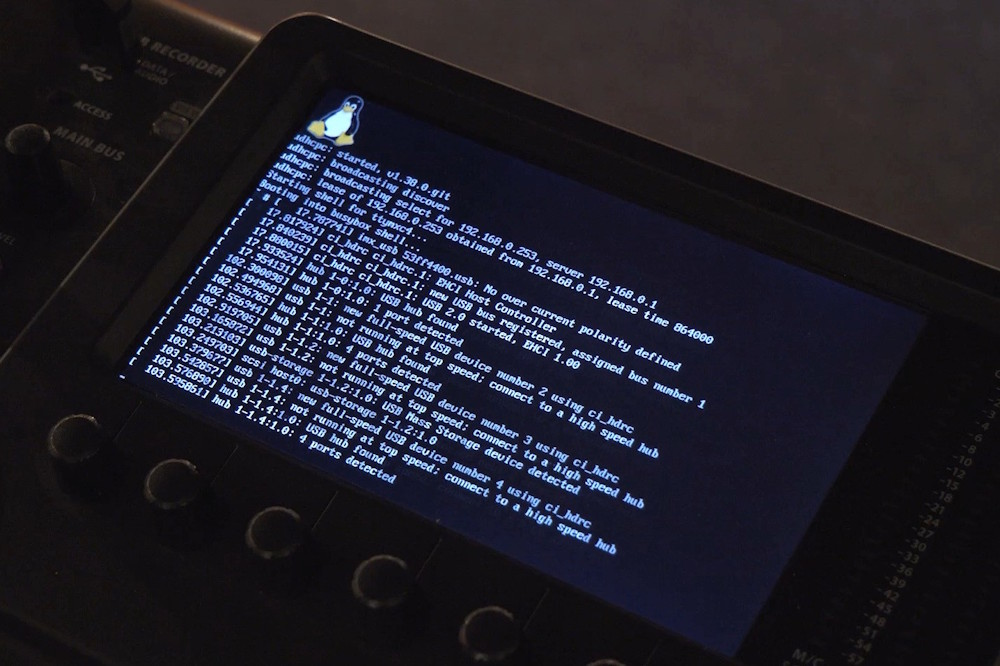
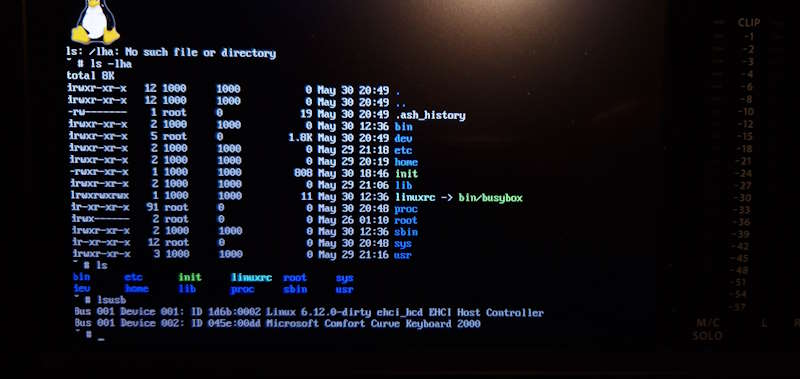
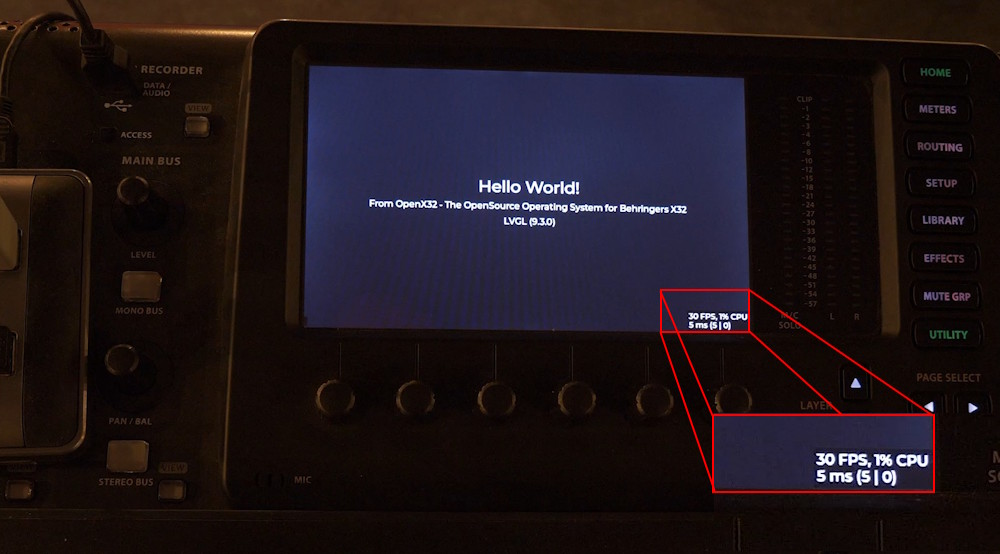

# OpenX32 - A linux-based operating system for the Behringer X32

This repository contains software to load and start the Linux-Kernel on the Behringer X32. This audio-mixing-console uses a Freescale/NXP i.MX253 Microcontroller with an ARM926EJ-S core that supports booting Linux.



Currently the Linux Kernel is running in Version 6.12 (LTS) with busybox:



More information in my related Youtube-Video:

[](https://www.youtube.com/watch?v=6CfLC5xVy90)

## General idea
The Behringer X32 has an USB-Type-B-Connector and two hidden switches at its back. The USB-connector is connected to an NXP i.MX253 microcontroller while the two switches are connected to its reset and boot-mode-switch. This allows us to boot the system in a firmware-update-mode.

Using the pyATK-software we can upload individual files directly to the RAM of the controller. Here a 64MB LPDDR is connected to the controller, so that we can upload a full linux-environment together with a bootloader and a DeviceTreeBlob for the individual hardware of the X32.

As the linux is started from RAM directly, this project is a temporary replacement of the mixer. After a power-cycle, the original firmware is in place again. But its possible to replace the original SD-card with a new one containing the OpenX32, to boot the linux automatically after a power-cycle.

## Steps to compile and load the new operating system

### Step 1: Init Git-Submodules and install dependencies
This system uses the most recent versions of the tools I could find: the bootloader u-Boot is used in Version 2020.10 as this is the last U-Boot supporting the i.MX25. Up to now Linux has still support for the i.MX25 and I selected v6.12, the most recent LTS-kernel.

So the repository uses other GitHub-repositories as submodules (u-Boot, Linux and pyATK). Please use the following command to checkout the main-repo together with submodules. To minimze the download-size and -time, we will clone the submodules separately:

```
git clone --depth 1 https://github.com/xn--nding-jua/OpenX32.git
cd openx32
./gitinitsubmodules.sh
```

Next to the sourcecode, your system needs to be setup correctly to compile the whole system: setup your debian-based system by calling:
```
./setup.sh
```

This script will install several dependencies to compile u-boot and the linux-kernel. After installing the packets, it will patch pyATK to run with recent versions of Python 3.11 and newer. It will also configure pyATK in a virtual python-environment.


### Step 2: Run the scripts

Compile u-boot, Linux and busbox by calling the script ./compile_all.sh and upload the new operating system into the RAM by calling the script ./run.sh

```
./compile_all.sh
./run.sh
```

* compile_all.sh will copy some patched files into the submodules, compile a small program called "miniloader", the U-Boot-bootloader and the Linux kernel. The kernel-image "zImage" will be converted to a "uImage" and will be merged together with the miniloader and u-boot-image into a single binary-file.
* Finally, run.sh will use pyATK to initialize the most important hardware of the i.MX253 using the file "meminit.txt" and upload the generated binary-blob into the RAM of the processor. The Serial-Download-Program of the i.MX will then start the small assembler-program "miniloader" placed at address 0x80000000 - hence the begin of the RAM. The only task of Miniloader is to jumpstart the U-Boot-Bootloader at offset 0x3C0. U-Boot is placed at offset 0x0C0, but the first function-entry of the U-Boot will not start when using the Serial-Download-Program. So with this small hack, U-Boot takes control over the i.MX, reallocate itself to a higher memory-region and starts the linux-kernel together with the DeviceTreeBlob. The kernel is then decompressed and will start up.

### Step 3: Compile user-softwares

Within the software-folder several user-applications are placed. At this early development-state you must compile each software individually:
* x32ctrl: call "make". The binary is copied to the folder "build/bin"
* fpgaconfig: run the script ./compile.sh. The binary is copied to the folder "build"
* uarttest: run the script ./compile.sh. The binary is copied to the folder "build"

To run the softwares, take an USB-Thumbdrive, copy all files to it and run them from this drive directly after mounting it in OpenX32 using command "mount /dev/sda1 /mnt/usb"

## What is working at the moment and what is planned so far
* [x] Linux-Kernel in Version 6.12 (LTS) starts to shell using display framebuffer
* [x] init-script for setting up the operating system
* [x] MIDI-Input and -output is used as an additional serial-port-terminal (see pinout down below)
* [x] Support of 800x480 32-bit framebuffer for applications (/dev/fb0)
* [x] Support of 100MBit ethernet network-support with DHCP
* [x] Support of internal Realtime-Clock
* [x] Support of USB-Host interface (HID-Keyboard, HID-Mouse, Mass-Storage-Devices, Joystick, Soundcard, etc.)
* [x] Control of X32 surface (faders, buttons, LEDs, encoders) through x32ctrl-software
* [x] Configuration of main-FPGA (Xilinx Spartan 3A, X3CS1400) via internal SPI-interface (use software fpgaconfig)

Some things are on the ToDo-list:
* [ ] Planned: ALSA Soundcard with I2S to main-FPGA (DeviceTree option "simple-audio-card" via SSI1 and AUDMUX is not initilializing)
* [ ] Planned: SD-Card support (DeviceTree option "esdhc1" is not starting up)
* [ ] Planned: GPIO support via libgpiod (at the moment libgpiod is not working and has no control over /dev/gpiochipX)
* [ ] Planned: Support of both AnalogDevices DSPs via SPI
* [ ] Planned: Support of Analog In- and Outputs of X32 with basic mixing options
* [ ] Planned: Support of UltraNet
* [ ] Planned: Support of AES50

LVGL v9.3.0 is running on the X32 with a good performance (30 fps). So this could be a basis for an open-source Operating System:


## Connecting a serial terminal to MIDI In/Out
The MIDI-Ports are connected to the UART5 of the i.MX25. With a simple resistor and a RS232/USB-converter the MIDI-ports can be used for a serial-terminal with 115200 baud:

    MIDI Out+ o---->---|       MIDI GND o------|          +5V o----->----o MIDI In+
      Pin 4          -----       Pin 2         o                           Pin 4
                     |   |                Pin 5 (GND)
                     |4k7|
      Pin 5          |___|                                                 Pin 5
    MIDI OUT- o----<---|----->----o Pin 2 (RxD)   Pin 3 (TxD) o-----<----o MIDI In-

## What's the reason for developing such a thing?
I want to learn things about embedded systems and how they work. The X32 is a very powerful playground with lots of different controllers, nice faders and displays. So that's the only reason why I'm doing this :-)

## Used third-party software
* U-Boot in Version 2020.10 (https://github.com/u-boot/u-boot/tree/v2020.10)
* Linux in Version 6.12 (https://github.com/torvalds/linnux/tree/v6.12)
* Busybox (https://git.busybox.net/busybox)
* pyATK in Version 0.1.0 (https://github.com/hbock/pyatk)
* LVGL in Version 9.3.0 (https://github.com/lvgl/lv_port_linux)
* OpenSSH Portable 8.3 (https://github.com/openssh/openssh-portable)
